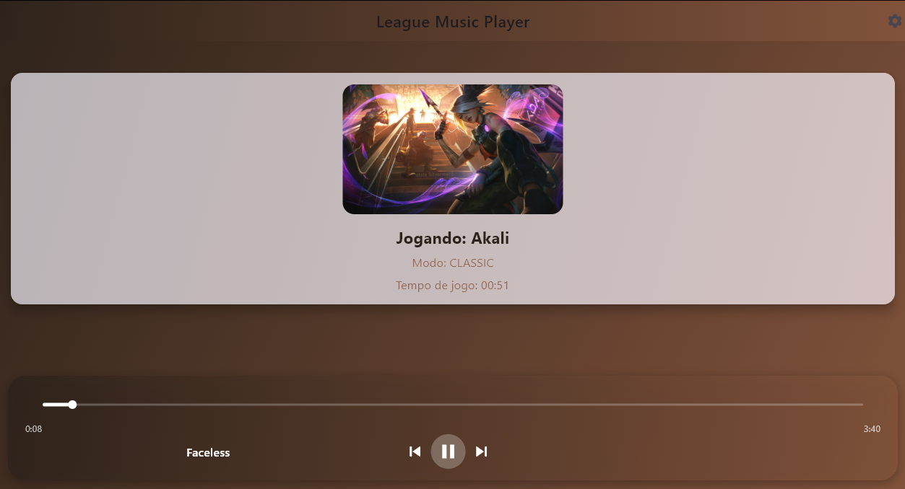

# 🎵 League Music Player


> **TL;DR:** Um player de música inteligente que detecta seu campeão no League of Legends e toca a trilha sonora perfeita para carregar a partida. 🎧⚔️

## 📖 Descrição

O **League Music Player** é uma aplicação que combina o universo de Runeterra com sua experiência musical. Ele monitora o estado do cliente do LoL em tempo real (via LCU API), detecta quando você entra em uma partida e qual campeão escolheu.

Com base nisso, o sistema gera dinamicamente uma playlist que se alinha ao tema e à atmosfera do campeão. O projeto utiliza um **Backend em Python** para orquestração de dados e áudio, e um **Frontend em Flutter** para uma experiência visual moderna.

> ⚠️ **Nota de Compatibilidade:** Este aplicativo foi desenvolvido nativamente para **Windows**. O funcionamento em Linux ou macOS não é garantido devido à dependência de bibliotecas de áudio e da integração com o cliente do League of Legends para Windows.

## ✨ Funcionalidades

- 🕵️ **Auto-Detecção**: Sabe automaticamente quando você entra na Champion Select ou na partida.
- 🦸 **Identificação de Campeão**: Reconhece o campeão e busca músicas temáticas.
- 🎼 **Playlists Dinâmicas**: Geração de filas de reprodução baseadas em metadados do jogo.
- 💾 **Gestão de Áudio**: Download e streaming otimizado usando `yt-dlp` e `ffmpeg`.

## 🛠️ Tecnologias Utilizadas

- **Frontend**: Flutter (Dart) para Desktop.
- **Backend**: Python (FastAPI).
- **IA & Orquestração**: [LangChain](https://www.langchain.com/) para lógica de playlists e [Groq](https://groq.com/) para inferência ultra-rápida.
- **Áudio**: FFmpeg e yt-dlp.

## 📸 Screenshot



---

## 🧠 Configuração da Inteligência Artificial (Groq)

Para que o **League Music Player** consiga analisar o campeão e criar playlists personalizadas na hora, ele utiliza a **Groq AI** (via LangChain), que é extremamente rápida e oferece um tier gratuito generoso.

Você precisará de uma **API Key** própria (é grátis e rápido). Siga os passos:

1.  Acesse o [Groq Cloud Console](https://console.groq.com/keys).
2.  Faça login (Google/GitHub/Email).
3.  No menu lateral, clique em **API Keys** -> **Create API Key**.
4.  Dê um nome (ex: `LeaguePlayer`) e clique em Submit.
5.  **Copie a chave gerada** (começa com `gsk_...`). Salve-a, ela não aparecerá novamente.

**Onde colocar a chave:**
* Crie ou edite o arquivo `config.json` dentro da pasta `backend/`.
    * O formato deve ser:
        ```json
        {
          "model": "modelo a ser usado (padrão llama-3.3-70b-versatile)" ,
          "api_key": "sua_chave_gsk_aqui..."
        }
        ```

## 🚀 Como Usar (Para Jogadores)

Não quer programar, apenas usar? Siga estes passos:

1. Vá até a aba **[Releases](https://github.com/Ppaulo03/LeagueMusicPlayer/releases)** aqui no GitHub.
2. Baixe o arquivo `.zip` da versão mais recente.
3. Extraia para uma pasta de sua preferência.
4. Execute o arquivo `app.exe` (o ícone do Flutter).
4. **Na primeira execução:** Insira sua chave da Groq nas configurações do app.
5. Abra o League of Legends, entre em uma partida e aproveite!

---

## 💻 Instalação e Desenvolvimento

Se você quer modificar o código ou buildar por conta própria, siga este guia.

### Pré-requisitos

- Python 3.8+
- Flutter SDK instalado e configurado no PATH
- Git

### 1. Clonar o Repositório

```bash
git clone [https://github.com/Ppaulo03/LeagueMusicPlayer.git](https://github.com/Ppaulo03/LeagueMusicPlayer.git)
cd SEU_REPO

```

### 2. Configurar o Backend

O projeto possui scripts de automação para facilitar a vida.

```bash
# Instalar dependências Python
pip install -r requirements.txt

# Baixar binários essenciais (FFmpeg e yt-dlp) automaticamente
python setup.py

```

*Nota: O script `setup.py` baixa e configura o FFmpeg e yt-dlp na pasta correta para desenvolvimento.*

### 3. Configuração da API

Crie um arquivo `.env` na raiz ou configure o `config.json` com suas credenciais se necessário.
*(Nota: O app usa a LCU local, mas se usar a API externa da Riot, insira sua Key aqui).*

### 4. Rodar em Modo de Desenvolvimento

Você precisará de dois terminais:

**Terminal 1 (Backend):**

```bash
python backend/app.py

```

**Terminal 2 (Frontend):**

```bash
cd mobile
flutter run

```

---

## 📦 Como Gerar o Executável (Build)

Para criar o instalador ou o arquivo `.zip` final para distribuição (Windows), utilizamos um script automatizado que compila o Python (com PyInstaller), compila o Flutter e une tudo.

Na raiz do projeto, execute:

```bash
python build_installer.py

```

O resultado estará na pasta `release_final/` e um arquivo `.zip` será gerado na raiz.

---

## 📂 Estrutura do Projeto

O projeto é um Monorepo organizado da seguinte forma:

```text
/
├── backend/            # Lógica Core (Flask/FastAPI, Regras de Negócio)
├── frontend/           # Frontend (Flutter App)
├── requirements.txt    # Deps do Python
├── setup.py            # Script para baixar dependências binárias (FFmpeg)
├── build.py            # Script de Build e Deploy
└── README.md

```

## 🤝 Contribuição

Pull Requests são bem-vindos! Para mudanças grandes, por favor abra uma **Issue** primeiro para discutir o que você gostaria de mudar.

## ⚖️ Licença e Legal

Este projeto está licenciado sob a [MIT License](https://www.google.com/search?q=LICENSE).

### Riot Games Disclaimer

> "League Music Player" isn't endorsed by Riot Games and doesn't reflect the views or opinions of Riot Games or anyone officially involved in producing or managing Riot Games properties. Riot Games, and all associated properties are trademarks or registered trademarks of Riot Games, Inc.